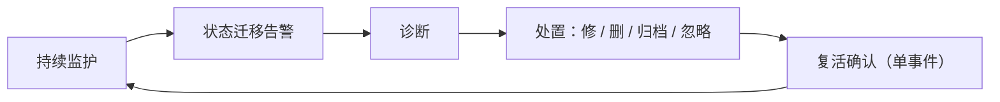
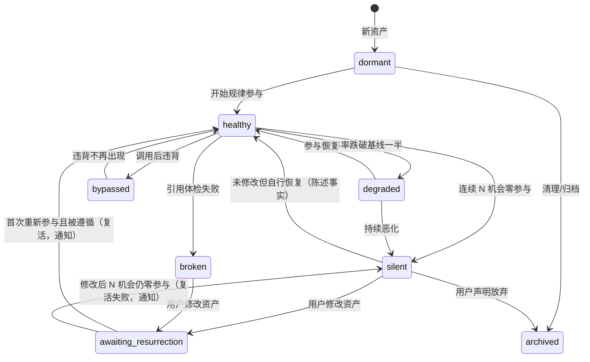
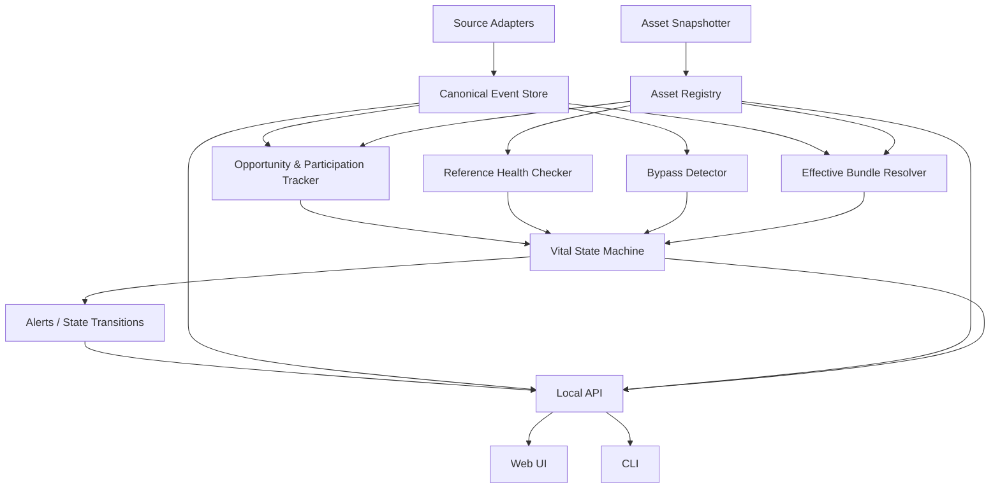

# Flatline · 核心系统设计

> 系统设计文档 · v0.4 · 2026-08-19
> 相对 v0.3 的根本变化：产品重心从"改善验收闭环"转向"资产生命体征监护"。三周观察窗与正式验收被判定为脱离个人用户数据现实的理想化设计；本版以静默失效检测为核心重建产品，正式改善轮次降级为可选进阶模式。
> 产品名已确认：**Flatline** —— "Your agent skills fail silently. Flatline notices."
> 引用文档说明：v0.3 系统设计文档与《flatline-backlog-improvement-cycle.md》未包含在本仓库；正文所引历史章节属于设计输入，实现以本文档为准。

## 0. 重心转移的理由（一段话记录，防止回退）

验收改善效果是统计问题，需要窗口和样本量，个人用户供养不起（环境变化快于样本累积，多数结论将是 inconclusive）；检测静默失效是预期问题，只需要资产自身的历史基线和"该出现却没出现"的单事件判定，个人用户的数据量完全够。产品最初的洞察——**部分资产在静默失效而用户不知道**——天然适配个人用户的证据经济学，且几乎完全建立在 Exact 级观测数据（显式调用、内容哈希、版本字段、引用体检）之上。

---

## 1. 产品定义

### 1.1 一句话定义

Flatline 是一台本地运行的 Agent 资产监护仪：它持续追踪每个 Skill、AGENTS.md、Rule、Hook 在真实工作会话中的生命体征，在资产静默失效、损坏或被绕行时告警，帮助用户诊断、修复或清理，并在资产复活的那一刻确认修复生效。

### 1.2 解决的问题

用户持续积累和修改 Agent 工作资产，但无法回答：

- 哪些资产还活着？哪些曾经有用、现在已经悄悄死了？
- 哪些资产从来就没被用过，只是在白白消耗上下文？
- 哪个资产引用的命令、路径已经不存在了？
- Agent 调用了某个资产之后，是否实际违背了它？
- 我上周那次修改之后，它活过来了吗？
- 环境（Harness 版本、模型）变化前后，哪些资产的参与发生了变化？

静默失效的本质是**信号的缺席**——没有报错、没有异常，资产只是不再参与。没有预期就无法识别缺席；本产品的核心机制就是为每个资产建立预期。

### 1.3 核心流程（四拍，全部事件驱动，不等统计窗口）



### 1.4 非目标

- 不做以统计验收为中心的改善流程（整体移入附录 B Backlog，UI 与代码均不实现）；
- 不替代 Harness、IDE 或任务执行器；
- 不输出不透明质量分；
- 不从时间相关性宣称因果；
- 不默认上传任何本地数据；
- 不自动修改或删除任何资产——包括"清理"在内的一切写操作必须用户显式确认。

---

## 2. 设计原则

本版本保留此前设计中已验证的原则：证据可重建、不确定性显式化、本地优先、缺失≠零、只读非阻断、变化可陈述因果需验证。观测等级的规范取值见 §3.1；本仓库不依赖未纳入的历史文档。新增/修订四条：

1. **预期来自资产自身的历史。**不依赖不可观测的候选集合，不与他人比较；每个资产的基线就是它自己过去的参与行为。
2. **状态迁移才开口。**系统只在资产进入沉默/失效/被绕行、或复活时主动通知；状态未变则永远沉默。这替代 v0.3 的"三种开口时刻"。
3. **删除是一等结局。**清理休眠资产与修复沉默资产同等重要；清理的收益（上下文占用下降、触发稀释减少）确定性可计算。
4. **验收降级为复活。**修改后的默认验证是"首次重新参与并被遵循"这个单事件，不是统计窗口。

---

## 3. 资产生命体征模型（产品核心）

### 3.1 基础概念

**机会（Opportunity）**：与该资产历史参与的任务形状同类的新 Session。沉默只能相对机会判定——没有机会不等于失效。

**参与（Participation）**：资产在一个 Session 中被观测到起作用。参与记录同时携带两个正交字段：

- `participation_signal`（发生了什么）：`offered`、`loaded`、`invoked`、`observed-use`、`followed`；其中 `followed` 表示行为遵循要求，不是观测等级。
- `observation_level`（如何知道）：`invoked`（显式调用，Exact）、`observed-use`（行为证据，derived）、`loaded`、`offered`（仅数据源支持时记录）、`inferred`（历史回测等推断）、`unknown`（数据源未记录）。各值必须如实标注，`unknown` 不得当作零。

`observation_level` 是事件、参与记录、API 与 UI 角标的 canonical 取值集；各适配器不得新增等级。基线与判定默认建立在最高可得等级上。

**基线（Baseline）**：滚动窗口内，该资产在机会 Session 中的参与率及绝对次数。基线本身在资产详情中可见、可解释。

### 3.2 生命体征状态

| 状态 | 判定规则（必须一行文案说得清） | 告警 |
| --- | --- | --- |
| `healthy` 健康 | 近期参与率与自身基线相当 | 否 |
| `degraded` 衰退 | 近期参与率 < 基线 × 0.5，且机会数 ≥ 5 | 低优先级 |
| `silent` 沉默 | 有基线（历史参与 ≥ 5 次且参与率 ≥ 30%），连续 ≥ N 个机会（默认 8）零参与 | **是** |
| `broken` 失效 | 引用体检失败：资产引用的命令/路径/工具已不存在（零 Session 也可判定） | **是** |
| `bypassed` 被绕行 | 显式调用后违背可形式化要求（invoked-then-violated detector） | **是** |
| `dormant` 休眠 | 存在 ≥ 30 天且累计参与 ≤ 2 次 | 否（进清理候选） |
| `no_opportunity` 暂无机会 | 窗口内没有同形状 Session | 否 |
| `unobservable` 不可观测 | 数据源无法提供参与信号 | 否（如实展示） |
| `awaiting_resurrection` 等待复活 | 沉默/失效/被绕行资产被修改后，尚未观测到重新参与 | 复活时**是** |
| `archived` 已归档 | 用户声明不再使用，停止监护 | 否 |

判定阈值全部可配置，但默认值必须满足"能在告警文案里一句话解释"的标准，例如：

> `sql-migrations` 进入沉默：此前同类任务 10 次中 7 次被调用；最近 8 次同类任务 0 次调用。沉默起点前 2 天：Claude Code 升级至 2.14。

### 3.3 状态机



任一资产任意时刻恰好处于一个主状态；`broken` 与其他状态可叠加（内容失效与参与状态是两个维度，UI 上失效优先展示）。

### 3.4 告警规则

- 只有状态迁移产生告警；同一资产同一状态不重复告警；
- "忽略"处置持久化于 `dispositions`，作用域为当前状态实例；迁移到其他状态时解除，之后再次进入原状态视为新的实例并按迁移规则告警；
- 告警必含：新状态、判定依据原文（分子/分母/基线）、迁移起点前后 ±3 天的环境与资产变化对齐列表、观测等级；
- 复活是正向告警，与问题告警同权重送达——修好东西的那一刻是产品最重要的情绪时刻。

---

## 4. 核心流程定义

### 4.1 持续监护

daemon 增量摄取 Session 与资产快照 → 更新机会计数、参与记录、基线 → 引用体检随资产版本变化触发 → 状态机评估 → 迁移则告警。

### 4.2 诊断

告警点开即诊断页（即资产详情的诊断视图），系统预排候选原因并各附证据，常见死因字典：

- 环境变化：迁移起点与 Harness/模型变化对齐；
- 拥挤：近期新增了描述相似的资产（相似度确定性可算），触发被稀释；
- 引用腐烂：体检失败项；
- 自身变更：资产自己某次修改后参与下降（版本标记对齐）；
- 任务结构变化：该类机会本身消失了（项目阶段变化，不是资产的错）；
- 未知：以上皆无证据，如实标注。

系统排列证据，不下因果结论。

### 4.3 处置（四个动作）

| 动作 | 系统行为 |
| --- | --- |
| 修改 | 打开 Diff/外部编辑器；可选采纳系统建议；保存后进入 `awaiting_resurrection` |
| 清理/删除 | 展示确定性收益（描述占用的上下文、稀释效应）；用户确认后归档并生成可回滚记录（不物理删除文件，提供移除建议或 .disabled 方案） |
| 归档 | 声明"不再使用"，停止监护，可随时恢复 |
| 忽略 | 接受现状；忽略作为 `Disposition` 持久化（`dispositions` 表，含原因），作用域为当前状态实例：该资产处于该状态期间不再告警；迁移到其他状态后再回到同一状态时视为新的状态实例，重新告警 |

### 4.4 复活确认

`awaiting_resurrection` 期间，首次观测到该资产重新参与且未违背 → 迁移至 healthy → 复活通知（"修改后首次被重新调用：今天 14:32，Session #…"）。修改后 N 个机会仍零参与 → 复活失败通知，回到诊断。单事件判定，无最小样本。

### 4.5 清理流（批量）

休眠资产累积到阈值时（不产生状态迁移告警，静默进入清理候选区），用户可进入批量清理：按最后参与时间排序、合计上下文占用、批量归档/保留、一键生成移除清单。这是新用户首日就能兑现的价值。产品可以提供不触发告警的月度休眠汇总，仅作为摘要，不改变"状态迁移才开口"原则。

### 4.6 正式改善轮次：不实现（→ 附录 B Backlog）

正式改善轮次（目标指标 + 防回归 + 观察窗 + 统计验收）不进入产品：UI 不实现、MVP 代码不实现、对象模型不包含。设计完整存档于附录 B，仅当复活检测被真实用户证明不足以支撑修改验证需求时重新评估。

---

## 5. 信息架构

一级导航三页：

```text
生命体征（首页） / 会话 / 变化时间线
```

| 页面 | 回答的问题 | 不承担 |
| --- | --- | --- |
| 生命体征 | 我的资产哪些活着、哪些死了、哪些在白白耗上下文？ | 不做 Session 浏览器，不做任务队列 |
| 会话 | Agent 一次真实工作具体做了什么？（沿用 v0.3 §5.5，含 EffectiveBundle） | 不管理流程 |
| 变化时间线 | 环境、资产、状态的变化如何在时间上对齐？ | 不判因果 |

资产诊断页是生命体征墙的下钻，不是独立一级入口。v0.3 的"总览/工作台"取消：墙即总览，告警即任务。

---

## 6. 本地系统架构

v0.3 §6 的采集与事实层全部保留：Source Adapters（字段矩阵/fixture/版本探测）、Asset Snapshotter（观测升级器）、Canonical Event Store（append-only + locator + EnvironmentChanged 锚点）、Effective Bundle Resolver（版本向量强制关联）。变化在派生层：



- **Opportunity & Participation Tracker**：任务形状归类、机会计数、参与记录（分观测等级）、基线滚动计算；
- **Reference Health Checker**：从资产内容提取命令/路径/工具引用，对本机环境体检；随资产版本变化与定时触发；
- **Bypass Detector**：invoked-then-violated（沿用实证结论：CC 侧证据链两端 Exact）；
- **Vital State Machine**：唯一的状态裁决者，输入三个 tracker，输出状态与迁移事件；所有阈值集中配置；
- **Alerts**：状态迁移的投影，不可独立创建（继承"任务是状态机投影"原则）；
- v0.3 的 Workflow/Observation Engine 移入可选进阶模块。

运行形态与技术选型不变：Go + 纯 Go SQLite 驱动 + 单二进制内嵌 SPA + loopback，daemon 唯一数据属主。

---

## 7. 数据模型与存储

### 7.1 对象模型

| 对象 | 说明 |
| --- | --- |
| Asset / AssetVersion / Session / Event / EffectiveBundle | 沿用 v0.3 |
| `Opportunity` | (session, 任务形状类, 涉及的资产集) |
| `Participation` | (asset_version, session, 参与形式, 观测等级) |
| `VitalState` | 资产当前状态 + 判定依据快照（分子/分母/基线/阈值版本） |
| `StateTransition` | 一次状态迁移：从/到、时间、依据、±3 天对齐变化列表 |
| `Disposition` | 用户对告警的处置：修改/清理/归档/忽略 + 原因 |
| `ReferenceCheck` | 一次引用体检结果（逐条引用 + 存在性） |

### 7.2 SQLite 表族增量

在 v0.3 §7.1 基础上：新增 `opportunities`、`participations`、`vital_states`、`state_transitions`、`dispositions`、`reference_checks`；移除 `decision_tasks`（告警由 `state_transitions` 投影）与 `improvement_cycles` 系列表（见附录 B Backlog，schema 不包含）。派生层照旧携带 detector/schema 版本、可整体重算——阈值调整后全量回放状态历史必须是廉价操作（这也是回测验收的基础）。

---

## 8. MVP 范围

必须完成：CC + Codex 适配器；资产快照与版本；机会/参与/基线追踪；**四个 detector：沉默判定、引用体检、调用后违背、休眠识别**；生命体征墙 + 诊断页 + 变化时间线；四种处置 + 复活确认；批量清理流；Session 基础浏览（借鉴 AgentView 水准）；全链路观测等级与 locator 展示。

不进入 MVP：AI 分析、账户/同步/团队、桌面壳、群体参考、插件运行时。正式改善轮次整体进入附录 B Backlog，UI 与代码均不实现。

---

## 9. 验收标准（含回测验收）

1. **回测正确性**：在开发者自己 ≥3 个月的真实历史上回放状态机，人工核验每个被判沉默/休眠/失效的资产——判定准确率是产品成立的前提，也是最便宜的证伪实验；
2. 任意告警可下钻到判定依据原文、机会列表、原始 Session 事件与当时资产版本；
3. 首次导入完成后，生命体征墙即刻呈现有意义的状态分布（历史回测点亮），无需等待新数据；
4. 从沉默告警到完成一次修改并收到复活通知，全流程无需离开产品（外部编辑器除外）；
5. 批量清理能给出确定性收益数字并生成可执行清单；
6. 每个比例可见分子分母；unknown 与 inferred 永不伪装成事实；
7. 全流程不依赖登录与上传。

---

## 10. 架构决策记录

- **ADR-1 本地优先**（沿用）。
- **ADR-2 单 daemon + SQLite + Go 单二进制**（沿用）。
- **ADR-3 自建 canonical schema，AgentView 类工具为解析参考/兼容输入**（沿用）。
- **ADR-4 预期来自资产自身历史。**不依赖候选集观测，不做跨用户比较；基线可解释、可下钻。
- **ADR-5 告警是状态迁移的投影。**不可独立创建或删除；同状态不重复告警。
- **ADR-6 验收降级为复活检测。**修改的默认验证是单事件（首次重新参与且未违背）；统计验收进入可选进阶模式。
- **ADR-7 删除是一等结局。**清理与修复同等重要；清理收益确定性计算；任何清理可回滚。
- **ADR-8 判定规则必须一句话可解释。**任何进入告警的阈值/算法，若无法在告警文案中用一行分子分母说清，不得上线。
- **ADR-9 确定性优先、AI 署名、显式授权写入**（沿用 v0.3 ADR-7/8）。
- **ADR-10 状态历史可廉价重放。**阈值与 detector 升级后全量回算状态历史，回测即验收。

---

## 附录 B · Backlog / 备选思路（不实现，仅存档）

**正式改善轮次（ImprovementCycle）**：围绕一次深思熟虑的资产修改建立目标指标、防回归指标、最小样本观察窗与统计验收。完整设计存档于《flatline-backlog-improvement-cycle.md》（状态机、confounded 规则、验收页规范；该历史文件未包含在本仓库）与 v0.3 §4-§5。MVP 不实现该能力，引用缺失不影响当前范围。搁置理由：统计验收的样本需求超出个人用户数据现实，环境变化快于样本累积，多数结论将是 inconclusive；复活检测（单事件验证）以极低成本承担了同一需求。重启条件：真实用户明确反馈"复活确认不足以让我信任修改效果"，且其 Session 量级足以在两周内积累可比样本。

**其余 Backlog**（无设计承诺）：AI 分析层、账户与多设备同步、团队协作、匿名群体参考区间、桌面壳、插件运行时、CI 集成、只读 MCP 查询。
